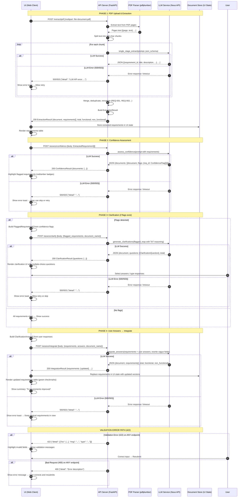

# C2 — UI-Model Interface Design

**Service:** Requirement Extraction API (MuSEE + Constrained Decoding)  
**Base URL:** `http://localhost:8100`  
**Framework:** FastAPI (Python 3.12+)  
**Auto-docs:** `GET /docs` (Swagger UI), `GET /redoc` (ReDoc)

---

## 1. Request Payload Schemas

### 1.1 POST /extract/text

Extract requirements from raw SRS text content.

**Content-Type:** `application/json`

| Field | Type | Required | Description |
|-------|------|----------|-------------|
| `document_name` | `string` | Yes | Name of the source document (e.g. `"get-real-0.2"`, `"mashboot"`) |
| `text` | `string` | Yes | Raw text content of the SRS document |

```json
{
  "document_name": "get-real-0.2",
  "text": "The student portal shall allow users to register an account...\n\nPerformance requirements: page load under 500ms..."
}
```

---

### 1.2 POST /extract/text

Extract requirements from raw SRS text content.

**Content-Type:** `application/json`

| Field | Type | Required | Description |
|-------|------|----------|-------------|
| `document_name` | `string` | Yes | Name of the source document (e.g. `"get-real-0.2"`, `"mashboot"`) |
| `text` | `string` | Yes | Raw text content of the SRS document |

```json
{
  "document_name": "get-real-0.2",
  "text": "The student portal shall allow users to register an account...\n\nPerformance requirements: page load under 500ms..."
}
```

---

### 1.3 POST /extract/pdf-to-txt

Extract raw text from a PDF file WITHOUT running LLM extraction. Returns page-by-page text so you can inspect, edit, or pass to `/extract/text` yourself.

**Content-Type:** `multipart/form-data`

| Field | Type | Required | Description |
|-------|------|----------|-------------|
| `file` | `file` (binary) | Yes | PDF file upload |

**Response:**

| Field | Type | Description |
|-------|------|-------------|
| `filename` | `string` | Original filename (without .pdf) |
| `page_count` | `integer` | Number of pages in the PDF |
| `pages` | `string[]` | Array of extracted text per page |

---

### 1.4 POST /extract/pdf

Extract requirements from an uploaded PDF file.

**Content-Type:** `multipart/form-data`

| Field | Type | Required | Description |
|-------|------|----------|-------------|
| `file` | `file` (binary) | Yes | PDF file upload. The service extracts text using `pdfplumber`. |
| `document_name` | `string` | No | Override document name. Defaults to the filename without `.pdf` extension. |

```
multipart/form-data
--boundary
Content-Disposition: form-data; name="file"; filename="get-real-0.2.pdf"
Content-Type: application/pdf

<binary PDF data>
--boundary
Content-Disposition: form-data; name="document_name"

get-real-0.2
--boundary--
```

---

### 1.5 POST /assess/confidence

Assess confidence of extracted requirements. Flags vague, incomplete, or ambiguous fields.

**Content-Type:** `application/json`

The request body is a JSON array of `ExtractedRequirement` objects.

#### ExtractedRequirement

| Field | Type | Required | Description |
|-------|------|----------|-------------|
| `requirement_id` | `string` | Yes | Sequential ID (e.g. `"REQ-001"`, `"REQ-002"`) |
| `title` | `string` | Yes | Short descriptive title for the requirement |
| `description` | `string` | Yes | Full requirement statement in `"The system shall..."` format |
| `type` | `string` (enum) | Yes | Either `"functional"` or `"non-functional"` |
| `acceptance_criteria` | `string[]` | Yes | Specific, testable acceptance criteria (may be empty) |
| `source_location` | `SourceLocation` | Yes | Traceability back to the source SRS document |

#### SourceLocation

| Field | Type | Required | Description |
|-------|------|----------|-------------|
| `document` | `string` | Yes | Name of the source document (e.g. `"mashboot"`, `"get real 0.2"`) |
| `verse` | `string[]` | Yes | Exact quote(s) from the SRS that this requirement was extracted from |

```json
[
  {
    "requirement_id": "REQ-001",
    "title": "User Registration",
    "description": "The system shall allow users to register an account using their email address and a password.",
    "type": "functional",
    "acceptance_criteria": [
      "User can submit email and password to create an account",
      "System validates email format before creating account"
    ],
    "source_location": {
      "document": "get-real-0.2",
      "verse": ["The system will allow students to register for an account by providing their email and a password."]
    }
  }
]
```

---

### 1.6 POST /assess/clarify

Generate targeted clarification questions for flagged requirements. Only send requirements that have confidence flags.

**Content-Type:** `application/json`

#### ClarifyRequest

| Field | Type | Required | Description |
|-------|------|----------|-------------|
| `flagged_requirements` | `FlaggedRequirement[]` | Yes | Array of requirements with their confidence flags |
| `document_name` | `string` | No | Document name for grouping. Defaults to `"unknown"`. |

#### FlaggedRequirement

| Field | Type | Required | Description |
|-------|------|----------|-------------|
| `requirement_id` | `string` | Yes | The requirement's ID (e.g. `"REQ-001"`) |
| `title` | `string` | Yes | Short descriptive title |
| `description` | `string` | Yes | Full requirement statement |
| `flags` | `ConfidenceFlag[]` | Yes | List of field-level confidence flags from `/assess/confidence` |

#### ConfidenceFlag

| Field | Type | Required | Description |
|-------|------|----------|-------------|
| `field` | `string` (enum) | Yes | Which field has the issue. One of: `"title"`, `"description"`, `"type"`, `"acceptance_criteria"`, `"source_location"` |
| `issue` | `string` | Yes | Description of the problem |
| `severity` | `string` | Yes | Severity level: `"low"`, `"medium"`, or `"high"` |
| `suggestion` | `string \| null` | No | Optional suggestion for improvement |

```json
{
  "flagged_requirements": [
    {
      "requirement_id": "REQ-003",
      "title": "Data Security",
      "description": "The system shall handle data securely.",
      "flags": [
        {
          "field": "description",
          "issue": "Description is vague - 'securely' is not specific or testable",
          "severity": "high",
          "suggestion": "Specify encryption standard, access control, or compliance requirement"
        },
        {
          "field": "acceptance_criteria",
          "issue": "No testable acceptance criteria provided",
          "severity": "high"
        }
      ]
    }
  ],
  "document_name": "get-real-0.2"
}
```

---

### 1.7 POST /assess/integrate

Integrate user clarification answers into the original requirements, producing updated and more concrete requirements.

**Content-Type:** `application/json`

#### IntegrateRequest

| Field | Type | Required | Description |
|-------|------|----------|-------------|
| `requirements` | `ExtractedRequirement[]` | Yes | The original extracted requirements (same schema as `/assess/confidence` input) |
| `answers` | `ClarificationAnswer[]` | Yes | User's answers to the clarification questions |
| `document_name` | `string` | No | Document name for grouping. Defaults to `"unknown"`. |

#### ClarificationAnswer

| Field | Type | Required | Description |
|-------|------|----------|-------------|
| `requirement_id` | `string` | Yes | Which requirement this answer addresses |
| `question` | `string` | Yes | The clarification question being answered (echoed back from `/assess/clarify`) |
| `answer` | `string` | Yes | User's answer / selected choice |
| `reasoning_path` | `string` | Yes | Which reasoning path generated the question: `"functional"`, `"dependency"`, or `"scope"` |

```json
{
  "requirements": [
    {
      "requirement_id": "REQ-003",
      "title": "Data Security",
      "description": "The system shall handle data securely.",
      "type": "non-functional",
      "acceptance_criteria": [],
      "source_location": {
        "document": "get-real-0.2",
        "verse": ["Data should be stored securely."]
      }
    }
  ],
  "answers": [
    {
      "requirement_id": "REQ-003",
      "question": "What level of encryption should be applied to stored user data?",
      "answer": "AES-256 encryption at rest for all PII fields",
      "reasoning_path": "dependency"
    }
  ],
  "document_name": "get-real-0.2"
}
```

---

### 1.6 GET /health

Health check endpoint. No request body.

---

## 2. Response Payload Schemas

### 2.1 POST /extract/text — ExtractionResult

| Field | Type | Description |
|-------|------|-------------|
| `document` | `string` | The source document name |
| `requirements` | `ExtractedRequirement[]` | Array of extracted requirements (schema defined in Section 1.3) |
| `total_requirements` | `integer` | Total number of requirements extracted |
| `functional` | `integer` | Count of functional requirements |
| `non_functional` | `integer` | Count of non-functional requirements |
| `extraction_version` | `string` | Pipeline version identifier. Currently `"single-stage-v1"`. |

```json
{
  "document": "get-real-0.2",
  "requirements": [
    {
      "requirement_id": "REQ-001",
      "title": "User Registration",
      "description": "The system shall allow users to register an account using their email address and a password.",
      "type": "functional",
      "acceptance_criteria": [
        "User can submit email and password to create an account",
        "System validates email format before creating account"
      ],
      "source_location": {
        "document": "get-real-0.2",
        "verse": ["The system will allow students to register for an account by providing their email and a password."]
      }
    }
  ],
  "total_requirements": 1,
  "functional": 1,
  "non_functional": 0,
  "extraction_version": "single-stage-v1"
}
```

---

### 2.2 POST /assess/confidence — ConfidenceResult

| Field | Type | Description |
|-------|------|-------------|
| `documents` | `DocumentConfidence[]` | Array of per-document confidence assessments |

#### DocumentConfidence

| Field | Type | Description |
|-------|------|-------------|
| `document` | `string` | Document name |
| `flags` | `object` (map) | Map of `requirement_id` (string) to `ConfidenceFlag[]` (array). Requirements with no flags are omitted from the map. |

```json
{
  "documents": [
    {
      "document": "get-real-0.2",
      "flags": {
        "REQ-003": [
          {
            "field": "description",
            "issue": "Description is vague - 'securely' is not specific or testable",
            "severity": "high",
            "suggestion": "Specify encryption standard, access control, or compliance requirement"
          },
          {
            "field": "acceptance_criteria",
            "issue": "No testable acceptance criteria provided",
            "severity": "high"
          }
        ],
        "REQ-007": [
          {
            "field": "title",
            "issue": "Title is too generic and does not describe the requirement scope",
            "severity": "medium",
            "suggestion": "Include the system component or actor being described"
          }
        ]
      }
    }
  ]
}
```

---

### 2.3 POST /assess/clarify — ClarificationResult

| Field | Type | Description |
|-------|------|-------------|
| `document` | `string` | The document name from the request |
| `questions` | `ClarificationQuestion[]` | Array of targeted clarification questions |
| `total_questions` | `integer` | Total number of questions generated |

#### ClarificationQuestion

| Field | Type | Description |
|-------|------|-------------|
| `requirement_id` | `string` | The requirement this question addresses |
| `question` | `string` | The clarification question text |
| `reasoning_path` | `string` | Which reasoning path generated this question: `"functional"`, `"dependency"`, or `"scope"` |
| `choices` | `string[]` | Suggested answer options for the user to pick from (may be empty) |

```json
{
  "document": "get-real-0.2",
  "questions": [
    {
      "requirement_id": "REQ-003",
      "question": "What level of encryption should be applied to stored user data?",
      "reasoning_path": "dependency",
      "choices": [
        "AES-256 encryption at rest",
        "TLS 1.3 for data in transit only",
        "Full disk encryption on the server",
        "Compliance with OWASP ASVS Level 2"
      ]
    },
    {
      "requirement_id": "REQ-003",
      "question": "Which data fields qualify as PII in this system?",
      "reasoning_path": "scope",
      "choices": [
        "Email address, name, date of birth",
        "All user-submitted form fields",
        "Only authentication credentials (password hashes)"
      ]
    }
  ],
  "total_questions": 2
}
```

---

### 2.4 POST /assess/integrate — IntegrationResult

| Field | Type | Description |
|-------|------|-------------|
| `document` | `string` | The document name from the request |
| `requirements` | `ExtractedRequirement[]` | Updated requirements incorporating user answers. Vague fields are rewritten to be concrete and testable. |
| `total_requirements` | `integer` | Total number of requirements |
| `functional` | `integer` | Count of functional requirements (may change from original) |
| `non_functional` | `integer` | Count of non-functional requirements (may change from original) |

```json
{
  "document": "get-real-0.2",
  "requirements": [
    {
      "requirement_id": "REQ-003",
      "title": "Data Security - AES-256 Encryption",
      "description": "The system shall encrypt all PII fields (email address, name, date of birth) using AES-256 encryption at rest.",
      "type": "non-functional",
      "acceptance_criteria": [
        "AES-256 encryption is applied to email, name, and DOB fields at rest",
        "Encryption keys are rotated according to organizational policy",
        "Data can be decrypted only by authorized services"
      ],
      "source_location": {
        "document": "get-real-0.2",
        "verse": ["Data should be stored securely."]
      }
    }
  ],
  "total_requirements": 1,
  "functional": 0,
  "non_functional": 1
}
```

---

### 2.5 GET /health — HealthResponse

```json
{
  "status": "ok",
  "service": "requirement-extraction"
}
```

---

## 3. Error Handling Specifications

The service uses standard FastAPI error handling with JSON error responses. Every error response follows a consistent structure.

### 3.1 400 Bad Request

**Triggers:**
- Invalid JSON in request body (unparseable)
- Missing required fields in form data
- Malformed multipart request

**Response Format:**
```json
{
  "detail": "Error description"
}
```

**Examples:**

Invalid JSON body:
```
POST /extract/text
Content-Type: application/json

{invalid json}
```
```
HTTP/1.1 400 Bad Request
Content-Type: application/json

{
  "detail": "Expecting property name enclosed in double quotes: line 1 column 2"
}
```

---

### 3.2 422 Validation Error (Unprocessable Entity)

**Triggers:**
- Pydantic schema mismatch (wrong type, missing required field, invalid enum value)
- Field value fails a Pydantic constraint

**Response Format:**
```json
{
  "detail": [
    {
      "loc": ["body", "field_name"],
      "msg": "validation error message",
      "type": "error_type"
    }
  ]
}
```

**Examples:**

Missing `text` field in extraction request:
```
POST /extract/text
Content-Type: application/json

{"document_name": "test"}
```
```
HTTP/1.1 422 Unprocessable Entity
Content-Type: application/json

{
  "detail": [
    {
      "loc": ["field2"],
      "msg": "Field required",
      "type": "missing",
      "input": {"document_name": "test"}
    }
  ]
}
```

Invalid `type` enum value in `ExtractedRequirement`:
```
POST /assess/confidence
Content-Type: application/json

[{
  "requirement_id": "REQ-001",
  "title": "Test",
  "description": "Test description",
  "type": "invalid_type",
  "acceptance_criteria": [],
  "source_location": {"document": "test", "verse": []}
}]
```
```
HTTP/1.1 422 Unprocessable Entity
Content-Type: application/json

{
  "detail": "Input should be 'functional' or 'non-functional' [type=enum, input_value='invalid_type', input_type=str]\n    For further information visit https://errors.pydantic.dev/2.10/v/enum"
}
```

---

### 3.3 500 Internal Server Error

**Triggers:**
- LLM API failure (authentication error, rate limit exceeded, model unavailable, malformed response from LLM)
- PDF parsing failure (corrupt file, unsupported format)
- Unexpected exceptions in the extraction pipeline

**Response Format:**
```json
{
  "detail": "Internal server error: error description"
}
```

**Examples:**

LLM API authentication failure:
```
HTTP/1.1 500 Internal Server Error
Content-Type: application/json

{
  "detail": "LLM API error: 401 Unauthorized — invalid API key"
}
```

LLM returns non-JSON response:
```
HTTP/1.1 500 Internal Server Error
Content-Type: application/json

{
  "detail": "LLM API error: Failed to parse JSON response — response was not valid JSON"
}
```

PDF parsing failure:
```
HTTP/1.1 500 Internal Server Error
Content-Type: application/json

{
  "detail": "PDF parse error: could not read file — file may be corrupted or password-protected"
}
```

---

### 3.4 503 Service Unavailable

**Triggers:**
- LLM API timeout (default: 300 seconds, configurable via `LLM_TIMEOUT_SECONDS` env var)
- LLM API connection refused / network unreachable

**Response Format:**
```json
{
  "detail": "Service unavailable: LLM API timeout after 300s"
}
```

**Examples:**

LLM API timeout during extraction:
```
HTTP/1.1 503 Service Unavailable
Content-Type: application/json

{
  "detail": "Service unavailable: LLM API timeout after 300s — chunk extraction exceeded maximum wait time"
}
```

LLM API connection failure:
```
HTTP/1.1 503 Service Unavailable
Content-Type: application/json

{
  "detail": "Service unavailable: Unable to connect to LLM API at https://inference-api.nousresearch.com/v1"
}
```

---

### 3.5 Error Handling Summary Table

| HTTP Code | Trigger | Client Action |
|-----------|---------|---------------|
| **400** | Invalid JSON, missing form fields | Fix request format, retry |
| **422** | Pydantic validation failure | Check field names, types, required fields, enum values |
| **500** | LLM API failure, PDF parse error, internal exception | Retry with backoff; check LLM API status; validate input PDF |
| **503** | LLM API timeout, network failure | Retry with increased timeout; check network connectivity |

---

## 4. Sequence Diagram: End-to-End Interaction Flow

The following diagram shows the complete flow from PDF upload through requirement extraction, confidence assessment, clarification, integration, and final result display. Error paths are shown with `alt` blocks.



---

## 5. Endpoint Summary

| Endpoint | Method | Request | Response | Error Codes |
|----------|--------|---------|----------|-------------|
| `/extract/text` | POST | `ExtractionRequest` | `ExtractionResult` | 400, 422, 500, 503 |
| `/extract/pdf` | POST | `multipart: file + document_name` | `ExtractionResult` | 400, 422, 500, 503 |
| `/assess/confidence` | POST | `ExtractedRequirement[]` | `ConfidenceResult` | 400, 422, 500, 503 |
| `/assess/clarify` | POST | `ClarifyRequest` | `ClarificationResult` | 400, 422, 500, 503 |
| `/assess/integrate` | POST | `IntegrateRequest` | `IntegrationResult` | 400, 422, 500, 503 |
| `/health` | GET | _(none)_ | `{"status": "ok"}` | 200 only |

---

## 6. Type Reference

### RequirementField Enum

Used in `ConfidenceFlag.field`:

| Value | Description |
|-------|-------------|
| `"title"` | The requirement title is problematic |
| `"description"` | The description is vague, ambiguous, or untestable |
| `"type"` | The functional/non-functional classification is questionable |
| `"acceptance_criteria"` | Acceptance criteria are missing or not testable |
| `"source_location"` | Source traceability is incomplete or missing |

### RequirementType Enum

Used in `ExtractedRequirement.type`:

| Value | Description |
|-------|-------------|
| `"functional"` | Describes what the system does |
| `"non-functional"` | Describes how the system performs (security, performance, etc.) |

### Severity Levels

Used in `ConfidenceFlag.severity`:

| Value | Meaning |
|-------|---------|
| `"low"` | Minor concern, informational |
| `"medium"` | Should be addressed for clarity |
| `"high"` | Critical issue — requirement must be refined before use |

### Reasoning Paths

Used in `ClarificationQuestion.reasoning_path` and `ClarificationAnswer.reasoning_path`:

| Value | Description |
|-------|-------------|
| `"functional"` | Questions about system behavior and functionality |
| `"dependency"` | Questions about technical dependencies, integrations, standards |
| `"scope"` | Questions about requirement boundaries, in-scope vs out-of-scope |

---

## 7. Performance Notes

- **PDF extraction** processes documents in 16,000-character chunks. Each chunk requires one LLM call. A 15-page document may take 5+ minutes depending on LLM response time.
- **LLM timeout** defaults to 300 seconds per call (configurable via `LLM_TIMEOUT_SECONDS` environment variable).
- **CORS** is enabled for all origins (`*`) — suitable for development. Production should restrict `allow_origins`.
- **Multi-pass extraction** (with deduplication) is available but defaults to a single pass.
